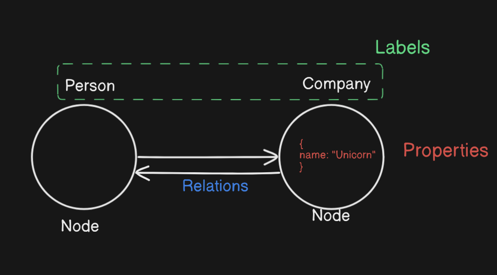

{/* for later ref: https://chat.deepseek.com/a/chat/s/a416f4ce-7963-4381-b026-224b105db0eb  */}

`Knowledge graphs` (KGs) map data as interconnected nodes, solving the relationship gap in vector databases. While vectors find semantically similar chunks, KGs answer how entities are linked—like a story behind the data.


## Understanding

To better understand data, we also need to understand the relationships within  the data,

### Problem
When you do use vector db you have been stored the content as chunks, but when you retrieve a relavant chunk, what it lacks are the relations as it could that in the data their might be a character, the LLM lacks context about the character's identity, so we introduce Knowledge Graphs.

* Only by just reading a chunk I can't generate the backstory of the data.


> Why graphs were adapted over vectors for LLM's?
> Vector embedding are good for semantic search  but they loose on relations, they(vectors) lack on context of what was and backstory of the data.
> Vectors excel at semantic search but fail to capture relationships. Knowledge graphs solve this by explicitly modeling connections.


### Graphs
Knowledge Graphs (KGs) early: "A knowledge graph organizes data as entities (nodes) and their relationships (edges), enabling contextual understanding."

We have entities (aka Nodes) that contains some data (i.e properties) and has relation to something.

> Graphs are non-linear (vs. vectors).




{/* TODO: a diagram of graphs as ex */}


#### Why Graphs Over Vectors?

* Also we need to understand Graphs alone aren't enough to solve the problem.

Now assume we have have big graph of 1m nodes, we can't search over the graph nor can retrieve the data fully (due to it's large in size) 
Now the problem is you don't have a starting point to get the relavant nodes of the graph

eg: when I tell you think of your life, there could be many things, you could be confused where to start with. But now if to you to just think of your best frien you now have a lot of things because you got the starting point to start thinking.

#### Hybrid Approach: Vectors + Graphs

We store chunks in Vector DB and index graph nodes, we can traverse back and we'll get relavant data/context to feed LLM


    why graphs need vectors for retrieval (e.g., "Graphs lack semantic search; vectors provide the entry point").


### Cypher queries

1. Create nodes
```
CREATE (c: Company{name: "UnicornSpace"}) RETURN c
```
> where c is variable name, Company is the type/label and name is property 


2. Add Relation
```
MATCH (c: Company{name: "UnicornSpace"}), 
    (n: Person{name:"Faizan"})
CREATE (n)-[:WORKS_AT]->(c)
RETURN n,c
```

3. Retrieving
```
MATCH (n: Company) RETURN n
```


## Code
There are 3 ways to approach code.
1.  RAW
2. Langchain
3. Mem0


### langchain (Abstract method  )

https://python.langchain.com/docs/how_to/graph_constructing/


```shell
%pip install --upgrade --quiet  langchain langchain-neo4j langchain-openai langchain-experimental neo4j
```


```py
import os

from langchain_neo4j import Neo4jGraph

os.environ["NEO4J_URI"] = "bolt://localhost:7687"
os.environ["NEO4J_USERNAME"] = "neo4j"
os.environ["NEO4J_PASSWORD"] = "password"

graph = Neo4jGraph(refresh_schema=False)

```
```py
import os

from langchain_experimental.graph_transformers import LLMGraphTransformer
from langchain_openai import ChatOpenAI

llm = ChatOpenAI(temperature=0, model_name="gpt-4-turbo")

llm_transformer = LLMGraphTransformer(llm=llm)

```


```py
from langchain_core.documents import Document

text = """
Marie Curie, born in 1867, was a Polish and naturalised-French physicist and chemist who conducted pioneering research on radioactivity.
She was the first woman to win a Nobel Prize, the first person to win a Nobel Prize twice, and the only person to win a Nobel Prize in two scientific fields.
Her husband, Pierre Curie, was a co-winner of her first Nknowledge-graph-representations.pngobel Prize, making them the first-ever married couple to win the Nobel Prize and launching the Curie family legacy of five Nobel Prizes.
She was, in 1906, the first woman to become a professor at the University of Paris.
"""
documents = [Document(page_content=text)]
graph_documents = await llm_transformer.aconvert_to_graph_documents(documents)
print(f"Nodes:{graph_documents[0].nodes}")
print(f"Relationships:{graph_documents[0].relationships}")

```


Storing the relations in db
```py
graph.add_graph_documents(graph_documents_props)

```
{/* <Mermaid
  chart="
graph TD;
subgraph AA [Consumers]
A[Mobile app];
B[Web app];
C[Node.js client];
end
subgraph BB [Services]
E[REST API];
F[GraphQL API];
G[SOAP API];
end
Z[GraphQL API];
A --> Z;
B --> Z;
C --> Z;
Z --> E;
Z --> F;
Z --> G;"
/> */}


### Mem0
{/* TODO: uncomment this image; it fails in no internet, try fixing it else, leave it to it's default behavior */}
{/*  */}

https://mem0.ai/

```py

```


## Usecases of knowledge graphs

1. Memory
2. Recommendation system
3. Personal assistant -
4. Medical - Track drug interactions across research papers.

* `Refresh Schema` -> Know what relations and nodes exist in db

> ChatGPT memories use KGs to link user preferences over time: navigate to chatgpt.com then go to settings > personalization > saved memories. There you can see you're saved memories

- [ ] Project Idea: 

1. make a project that converts a pdf with friction stories -> chucking -> cypher queries -> knowledge graphs
 PDF → Text extraction → LLM-generated nodes/edges → Neo4j.

