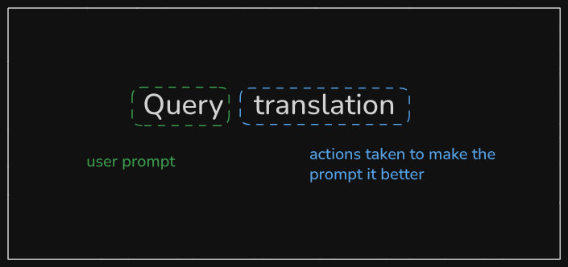
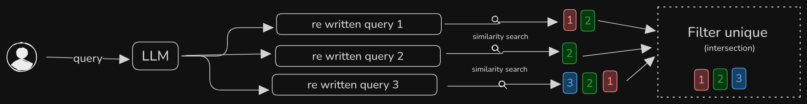
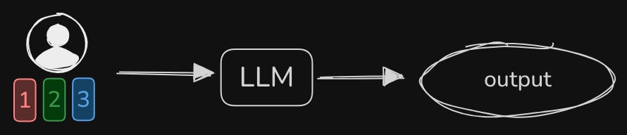

The whole moto is to make the user prompt better. Basically sometimes the user is not sure in the `{user prompt}` what exactly he wants, because user can intend something and can type something else. Now if the input is ambigous then the output also will be ambigous (not having one obvious meaning)

<Mermaid chart="
flowchart LR
  A e1@--> B
  e1@{ animation: fast }

"/>

> Note: Think it as GIGO (Garbage In Garbage Out)

> Understand that what user is asking and they're intending could be different, so if we can make the user query better by predicting what the user is intending with, then we can make the query better.

## Abstraction vs Less Abstraction

Now think of abstraction as, when you tell "I'm thirsty" that means you expect others to understand and get you water.

But on the other hand, in less abstraction way it would be "I'm thirsty, I need full glass of warm drinking water"

Here well it depends on usecase to usecase.
 {/* Basically less abstraction and more abstraction both are necessary */}

{/* TODO: basically the context is not proper here wrt genai, do add something */}

## There are different ways to do query translation

Rewrite is one of the way, we're using here, variants to Rewrite

### Parallel Query(Fan out) Retrieval

> Intersection: the set of all elements common to two or more sets.

> FanOut: When 1 event is put into multiple quees you fanout the messge (in system design)
{/* TODO: This fanout def needs rewrting */}

### 2. Resprocate Rank Fusion (RRF)

## Query decomposition

### Step back prompting (Few shot prompting.)