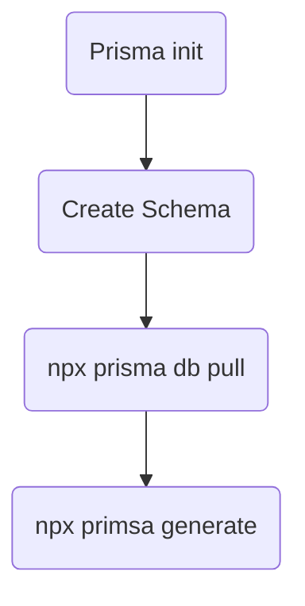

# Prisma Advanced

## Seeding the data in db

Database seeding is the process of populating a database with initial data, such as dummy data or user accounts, when an application is first set up. It's especially useful during development, when you need to populate the database with sample data to test the application

```ts
// prisma/seed.ts

import { PrismaClient } from "@prisma/client";

const prisma = new PrismaClient();

const pets = [
  {
    name: "Benjamin",
    ownerName: "John Doe",
    imageUrl:
      "https://images.unsplash.com/photo-1517849845537-4d257902454a?auto=format&fit=crop&q=100&w=1935&ixlib=rb-4.0.3&ixid=M3wxMjA3fDB8MHxwaG90by1wYWdlfHx8fGVufDB8fHx8fA%3D%3D",
    age: 2,
    notes:
      "Doesn't like to be touched on the belly. Plays well with other dogs.",
  },
  {
    name: "Richard",
    ownerName: "Josephine Dane",
    imageUrl:
      "https://images.unsplash.com/photo-1583337130417-3346a1be7dee?auto=format&fit=crop&q=100&w=1964&ixlib=rb-4.0.3&ixid=M3wxMjA3fDB8MHxwaG90by1wYWdlfHx8fGVufDB8fHx8fA%3D%3D",
    age: 5,
    notes: "Needs medication twice a day.",
  },
  {
    name: "Anna",
    ownerName: "Frank Doe",
    imageUrl:
      "https://images.unsplash.com/photo-1537151625747-768eb6cf92b2?auto=format&fit=crop&q=100&w=1970&ixlib=rb-4.0.3&ixid=M3wxMjA3fDB8MHxwaG90by1wYWdlfHx8fGVufDB8fHx8fA%3D%3D",
    age: 4,
    notes: "Allergic to chicken.",
  },
];

async function main() {
  console.log(`Start seeding ...`);

  for (const pet of pets) {
    const result = await prisma.pet.create({
      data: pet,
    });
    console.log(`Created pet with id: ${result.id}`);
  }

  console.log(`Seeding finished.`);
}

main()
  .then(async () => {
    await prisma.$disconnect();
  })
  .catch(async (e) => {
    console.error(e);
    await prisma.$disconnect();
    process.exit(1);
  });
```

1. Add the seed script to package.json

```json
{
  "scripts": {
    // ...
  },
  "prisma": {
    "seed": "ts-node --compiler-options {\"module\":\"CommonJS\"} prisma/seed.ts"
  }
  // ...
}
```

2. Now seed the data

```
npx prisma db seed
```

### Choosing between db push and prisma migrate

https://www.prisma.io/docs/orm/prisma-migrate/workflows/prototyping-your-schema#choosing-db-push-or-prisma-migrate

`db push`

- You want to quickly prototype and iterate on schema design locally without the need to deploy these changes to other environments such as other developers, or staging and production environments.
- You are prioritizing reaching a desired end-state and not the changes or steps executed to reach that end-state (there is no way to preview changes made by db push)
- You do not need to control how schema changes impact data. There is no way to orchestrate schema and data migrations—if db push anticipates that changes will result in data loss, you can either accept data loss with the --accept-data-loss option or stop the process. There is no way to customize the changes.

---

> Run `prisma db pull` to turn your **database schema** into a **Prisma schema**.

> Run `prisma generate` to generate the **Prisma Client**. You can then start querying your database

> What is `prisma db push`

> What is `prisma migrate dev `



# DB relationships

1. 1-many (one user can have many pets)

- db push ->

>

Once you can the prisma schema, you need to update prisma client and also our db,
