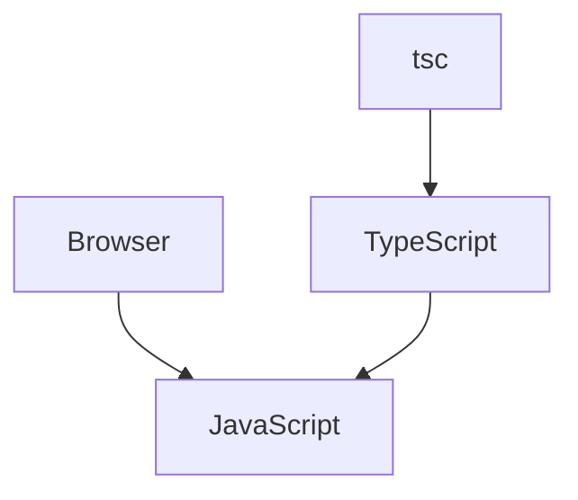

# TypeScript

TypeScript is JavaScript with **superpowers**.

- It is a strict syntactical superset of JavaScript and adds optional types to the language.
- Developed and maintained by **Microsoft**.
- TypeScript is like the next powerful version of JavaScript. It allows you to do everything that JavaScript does but adds extra features to make it more developer-friendly and safer.

### Strongly Typed vs Loosely Typed

#### Strongly Typed
**Benefits:**
- Fewer runtime errors.
- Strict codebase.
- Easy to catch bugs at compile time.

Example:
```cpp
#include <iostream>
int main() {
    int num = 10;
    return 0;
}
```

#### Loosely Typed
**Benefits:**
- Easy to write code.
- Fast for prototyping and bootstrapping.
- Low learning curve.

Example:
```typescript
let num = 10;
num = "Hello"; // This is allowed in JS but will throw an error in TS.
```

### Why TypeScript?

People realized that JavaScript is a very powerful language but lacks types. TypeScript was introduced as a new language to add types on top of JavaScript.

---

## How Does TypeScript Code Run?

1. The browser runs in **JavaScript**.
2. TypeScript gets compiled down to JavaScript (using a transpiler like `tsc`).

- **JavaScript** is a runtime language.
- **TypeScript** is a compile-time language that ensures type safety before converting to JavaScript.



---

## Installation and Setup

1. Install TypeScript globally:
   ```bash
   npm i -g typescript
   ```

2. Initialize a project:
   ```bash
   npm init -y
   ```

3. Compile TypeScript files:
   ```bash
   npx tsc index.ts
   ```

---

## TypeScript Features

### Annotations
Annotations specify the **datatype** of variables, parameters, function return values, and more.

```typescript
function add(n1: number, n2: number): number {
    return n1 + n2;
}
```

### Basic Types
- `number`, `string`, `boolean`, `null`, `undefined`, `any`

Example:
```typescript
let myType: number = 42;
let yourType: string = "Hello, TypeScript!";
```

### Functions as Arguments
```typescript
function delay(func: () => void): void {
    setTimeout(func, 1000);
}
```

**Annotations** help developers catch errors early in development by specifying the types of values. This makes code predictable and reliable.

---

# `tsconfig.json`

### Key Properties:

- `"target": "es2016"`  
  Converts code to the latest feature.
- `"es5"`  
  Converts code to ES5 features by converting arrows to normal functions.

- `"rootDir"`  
  Specifies the source directory (e.g., `/src`).
- `"outDir"`  
  Specifies where the compiled code should be stored (e.g., `/dist` or `/build`).
- `"noImplicitAny"`  
  Ensures that types are explicitly assigned and not defaulted to `any`.
- `"removeComments"`  
  Removes comments during compilation.

---

## Interface

Interfaces help you define the structure of objects. This ensures that your code works as expected and that objects adhere to a particular structure.

### Example:

```typescript
interface User {
  firstName: string;
  age: number;
  email?: string; // Optional property
}

function isLegal(user: User) {
  // This ensures `user` matches the `User` interface structure.
}
```

---

# Types in TypeScript

Types let you aggregate data together.

### Example:

```typescript
type User = {
  firstName: string;
  lastName: string;
  age: number;
};
```

**Notes:**
- Types are similar to interfaces but cannot be implemented.
- They provide extra features for flexibility.

---

## Unions

Unions allow you to specify a variable that can have several possible types, which is helpful when working with data of multiple types.

### Example:

```typescript
type StringOrNumber = string | number;

function printId(id: StringOrNumber) {
  console.log(id);
}

printId("1"); // ✔
printId(1);   // ✔
```

---

## Type Inference

```typescript
type Invoice = {
  status: "paid" | "unpaid";
};
```

- The `status` property can only have one of the specified string literal types (`"paid"` or `"unpaid"`).

---

# Intersections

### Combining Multiple Types

#### Example:

```typescript
type Employee = {
  name: string;
  startDate: Date;
};

type Manager = {
  name: string;
  department: string;
};

// Combining Employee and Manager types
type TechLead = Employee & Manager;

// Usage example
const t1: TechLead = {
  name: "Faisam",
  startDate: new Date(),
  department: "R&D",
};
```

- The `TechLead` type combines properties from both `Employee` and `Manager`.

---

# Arrays

### Type Annotations

#### Example:

```typescript
function makeArray(num: number) {
  return [num]; // Annotated to return an array of numbers
}

// Using number array types explicitly
type numArray = number[];
function makeArray(nums: numArray) {
  return nums;
}

// Interface for array of objects
interface User {
  name: string;
  age: number;
}

// A function accepting an array of User objects
function filterUsers(users: User[]) {
  return users.filter(user => user.age > 18);
}
```

- Arrays in TypeScript can be annotated to ensure type safety.

---

# Enums

### Explanation:

Enums allow you to define a set of named constants. They help create a human-readable way to represent a set of constant values.

#### Example:

```typescript
enum Direction {
  Up,
  Down,
  Right,
  Left,
}

function doSomething(keyPressed: Direction) {
  if (keyPressed === Direction.Up) {
    console.log("Moving Up!");
  }
}

// Usage
doSomething(Direction.Up);

// Default Enum Values
console.log(Direction.Up); // Output: 0 (Enums start from 0 by default)

// You can also change the default values
enum CustomDirection {
  Up = 1,
  Down = 2,
  Right = 3,
  Left = 4,
}
```

---

## Handling Environment Variables

Sometimes, TypeScript highlights errors when importing environment variables. To resolve this, we can just add a type assertion (`as string`) to indicate that it will be a string and not undefined. This way, we communicate to TypeScript that "I know what I’m doing," and it can proceed without errors.

```typescript
process.env.PORT as string;
```

## Arguments as Objects or Normal Arguments

You can define arguments as objects or just normal arguments in TypeScript. Here's an example:

### Interface Definition
```typescript
interface UserProps {
  name: string;
  age: number;
}
```

### Using the Interface

#### Example 1
Passing the object directly to a function:
```typescript
const userFunc = ({ name, age }: UserProps) => {
  // Your logic here
};
```

#### Example 2
Destructuring the object within the function:
```typescript
const userFunc = (user: UserProps) => {
  const { name, age } = user;
  // Your logic here
};
```

#### Example 3
Providing optional properties:
```typescript
const userFunc = ({ name, age }: { name: string; age?: number }) => {
  // Ensure logic handles whether age is given or not
};
```

## Static Typing

TypeScript allows you to catch type-related errors at compile time rather than runtime. This helps you write more reliable code and catch errors early in the development process.

```typescript
const marks: number = 80;
let genre: string = "Horror";
```

## Type Inference

TypeScript can infer the type of a variable based on its value. This saves time and makes your code more concise.

```typescript
let x = 8; // TS infers `x` is of type `number`
```

## Optional Chaining

Optional chaining allows you to safely access nested properties without worrying about null or undefined values. This helps prevent runtime errors when working with potentially incomplete data.

```typescript
const user = {
  name: "John",
  address: {
    city: "New York",
  },
};

const city = user.address?.city; // Accesses `city` safely
```

## Type Guards

Type guards are a way to narrow down the type of a variable within a block of code. They allow you to work with variables of different types in a type-safe manner.

```typescript
function printer(name: string | string[]) {
  if (typeof name === "string") {
    // Handle case where name is a string
  } else {
    // Handle case where name is an array of strings
  }
}
```

---

## Type Inference

Type inference is a feature in TypeScript that allows the compiler to automatically determine the type of a variable based on its value.

In other words, if you define a variable without explicitly specifying its type, TypeScript will try to infer the type based on the value you assign to it.

```typescript
let name = "faizan"; // TypeScript infers the type as string
name = true; // Error: Type 'boolean' is not assignable to type 'string'
```

---

## Any Type

TypeScript has a special `any` type that can be used to represent any type. When a variable is annotated with `any`, TypeScript will allow it to have any value and will disable all type checking for that variable and its properties.

```typescript
let color: any = "red";
color = 10; // Valid
```

---

## Function Parameter Annotations

Function parameter annotations are used to specify the expected types of the parameters that a function takes.

```typescript
function addOne(n: number) {
  return n + 1;
}

addOne(5); // Valid
addOne(true); // Error: Argument of type 'true' is not assignable to parameter of type 'number'
addOne(5, 2); // Error: Expected 1 argument, but got 2
```

> **Note**: TypeScript will also give warnings if you misspell or misuse parameters.

---

## Return Annotations

You can use return annotations to specify the type of value a function will return.

```typescript
function doubleNum(num: number): number {
  return num + num;
}
```

---

## Void in TypeScript

The `void` type represents the absence of any value. It is often used as the return type for functions that do not return a value.

```typescript
function greet(name: string): void {
  console.log("Hi", name);
  return 10; // Error: Type 'number' is not assignable to type 'void'
}
```

# Never

The `never` keyword in TypeScript is used to indicate that a function will not return anything or that a variable can never have a value. The `never` type is useful for indicating that certain code paths should not be reached or that certain values are impossible. It can help catch errors at compile time.

### Examples of `never` usage:
- A function that always throws an error.
- A function that contains an infinite loop.
- A function variable that can never have a value.

---

# Array Types

Arrays are types of objects that can store multiple values of the same datatype. Arrays in TypeScript are typed, meaning you can specify the type of values an array can hold.

### Declaring Arrays:
You can declare arrays using:
1. **Square bracket notation:** `[]`
2. **Generic array notation:** `Array<Type>`

```typescript
const nums: number[] = [1, 2, 3]; // Array of numbers
const names: Array<string> = ["A", "B", "C"]; // Array of strings

// If you add other values of different datatypes, it will give an error.
```

### Multi-Dimensional Arrays:
A multi-dimensional array is an array that contains other arrays as its elements. These arrays can be defined using square brackets.

```typescript
const matrix: number[][] = [
  [1, 2, 3],
  [4, 5, 6],
];
```

---

# Objects

An object in TypeScript is a structured data type that represents a collection of properties, each with a key and an associated value. The properties of an object can have specific types, and the object itself can be annotated with a type, often defined using an interface or a type alias.

TypeScript uses structural typing, meaning that the shape of an object (its structure or properties) is what matters for type compatibility.

### Example:
```typescript
type Person = {
  name: string;
  age: number;
};

const person: Person = {
  name: "Rajesh",
  age: 20,
};
```

> **Note:** You have to provide all the values; it should be of the same type and no extra values can be added.

---

# Type Aliases

A type alias is a way to create a new name for an existing type. It allows you to define a custom type that refers to another type and give it a more meaningful or descriptive name.

### Defining a Type Alias:
Type aliases are defined by the `type` keyword, followed by the name of the alias, an equal sign (`=`), and then the type it refers to.

```typescript
type MyString = string;
```

# Advanced TypeScript Features

## Type Aliases with Functions
You can define a type alias for objects and use it in functions.

```typescript
type Person = { name: string; age: number };

function display(person: Person): void {
  console.log(person);
}

const myPerson: Person = { name: "Faizan", age: 20 };
display(myPerson);
```

---

## Optional Properties
You can make certain properties optional in an object by adding a question mark (`?`) after the property name.

```typescript
type Person = { name: string; age?: number };

// This is optional, but even if you don't provide the property, TypeScript automatically adds `age: undefined`.
```

---

## Readonly
The `readonly` modifier ensures that the property can only be read but not updated.

```typescript
type User = { name: string; readonly location: string };

const user: User = { name: "Faizan", location: "India" };
user.location = "USA"; // Error: Cannot assign to 'location' because it is a read-only property.
```

---

## Intersection Types
An intersection is a way to combine multiple types into a single type that includes all the properties and methods of each constituent type. Use the `&` symbol.

```typescript
type Person = { name: string };
type Employee = { title: string };

type PersonAndEmployee = Person & Employee;

const p1: PersonAndEmployee = {
  name: "Faizan",
  title: "Developer",
};
```

---

# Union Types
Unions allow a type to have one of several possible types. Use the `|` symbol to define unions.

```typescript
let phones: number | number[];
type EmployeeOrUser = EmployeeType | UserType;

const items: (number | string)[] = [1, 2, 3, "Hi"];
// With unions, you can use only either type, but not a mix of both types.
```

---

# Literal Types
Literal types allow you to specify a value that can only be one specific value. This means a variable with a literal type can only have that specific value.

### String Literal Types
```typescript
type Color = "red" | "green" | "blue";

let color: Color = "red"; // Valid
color = "orange"; // Invalid
```

### Numeric Literal Types
```typescript
let options: 1 | 2 | 3;
options = 1; // Valid
options = 9; // Invalid
```

### Boolean Literal Types
```typescript
let isTrue: true;
isTrue = true; // Valid
isTrue = false; // Invalid
```

# Tuples

Tuples are a type in TypeScript that represent an array with a fixed number of elements, where each element can have a different type. The order of types in the tuple definition corresponds to the order of values in the array. Tuples are similar to arrays but have a specific structure and are used to model finite sequences with known lengths.

### Example:
```typescript
let myTuple: [number, string];
myTuple = [10, "Hello"]; // Valid
myTuple[0]; // 10

myTuple = ["Hello", 10]; // Error: Type mismatch
```

---

# Enums

Enums are a way to define a set of named constants. They allow you to define a collection of related values that can be used interchangeably in your code.

### Example:
```typescript
enum WeatherCondition {
  Sunny = "Sunny",
  Cloudy = "Cloudy",
  Rainy = "Rainy",
  Snowy = "Snowy",
}

const currentWeather: WeatherCondition = WeatherCondition.Sunny;
console.log(currentWeather); // "Sunny"
```

### Numeric Enums:
Enums can also have numeric values, automatically assigned starting from `0` unless specified otherwise.

```typescript
enum Directions {
  North,
  East,
  South,
  West,
}

console.log(Directions.North); // 0
console.log(Directions.East); // 1
```

---

# Interfaces

Interfaces are a way to define a contract for the shape of an object. They specify the properties and types that the object must have. They're a powerful tool for enforcing a consistent structure in your code.

### Example of an Interface:
```typescript
interface Person {
  firstName: string;
  lastName: string;
  age: number;
}

const person: Person = {
  firstName: "Faizan",
  lastName: "Khan",
  age: 20,
};
```

While interfaces are commonly used to define the structure of objects, they are not limited to objects alone. Interfaces in TypeScript can also be used to describe the shape of functions and classes.

### Example with a Function:
```typescript
interface MathOperation {
  (x: number, y: number): number;
}

const add: MathOperation = (a, b) => a + b;
```

## Generics in TypeScript

### Without Generics

```typescript
const printString = (x: string) => console.log(x);
const printNum = (x: number) => console.log(x);
const printBoolean = (x: boolean) => console.log(x);

printString("Hi!");
printNum(10);
printBoolean(true);
```

### With Generics

```typescript
function printInfo<T>(x: T): T {
  console.log(x);
  return x;
}

printInfo<string>("Hi!");
printInfo<number>(10);
printInfo<boolean>(true);
```

### Example: Generic Array Filter Function

```typescript
function filterArray<T>(
  array: T[],
  condition: (item: T) => boolean
): T[] {
  return array.filter((item) => condition(item));
}

// Filtering numbers
const numArray = [1, 2, 3, 4, 5, 6, 7, 8, 9, 10];
const evenNumbers = filterArray<number>(numArray, (num) => num % 2 === 0);
console.log(evenNumbers); // Output: [2, 4, 6, 8, 10]

// Filtering strings
const strArray = ["apple", "chikoo", "banana", "cherry"];
const shortWords = filterArray<string>(strArray, (word) => word.length < 6);
console.log(shortWords); // Output: ["apple", "chikoo"]
```

### Generic Functions with Multiple Types

```typescript
function reversePair<T, U>(val1: T, val2: U): [U, T] {
  return [val2, val1];
}

const reversedPair = reversePair("Hello", 20);
console.log(reversedPair); // Output: [20, "Hello"]


